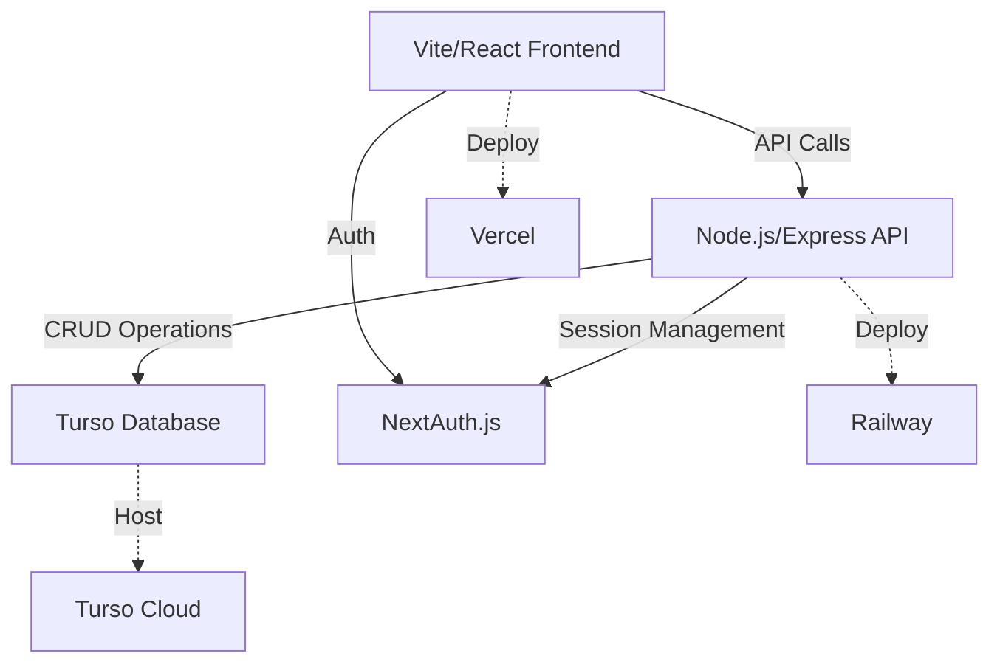

# Skill Launchpad MVP - Technology Documentation

## Technology Stack
- **Frontend**: Vite + React (TypeScript)
- **UI Components**: shadcn/ui
- **Styling**: Tailwind CSS
- **Backend**: Node.js + Express
- **Database**: Turso (SQLite)
- **Authentication**: Session cookies with NextAuth.js (supports social logins)
- **Deployment**:
  - Frontend: Vercel
  - Backend: Railway
  - Database: Turso Cloud

## Architecture Overview

## Key Components
1. **Frontend Application**
   - Vite + React (TypeScript) setup
   - shadcn/ui component library
   - Tailwind CSS for styling
   - React Router for navigation
   - NextAuth.js client integration

2. **Backend API**
   - Node.js + Express server
   - RESTful endpoints for:
     - Content management
     - Forum/discussion
     - User management
   - Session cookie authentication
   - Turso database client

3. **Authentication**
   - NextAuth.js for session management
   - Support for:
     - Email/password
     - Social providers (Google, GitHub, etc.)
   - Cookie-based sessions

4. **Database**
   - Turso (SQLite) for data persistence
   - Tables for:
     - Users
     - Content posts
     - Forum topics/replies
     - Memberships

## Development Approach
1. **Initial Setup**
   - Create Vite/React project
   - Add shadcn/ui components
   - Set up Node.js/Express backend
   - Configure Turso connection

2. **Core Features**
   - Implement authentication flow
   - Build content posting system
   - Create discussion forum
   - Add membership gating

3. **Polish & Deployment**
   - Styling with Tailwind CSS
   - Testing
   - Deploy backend to Railway
   - Deploy frontend to Vercel
   - Configure production database

## Deployment Strategy
- **Frontend**: Vercel
  - Automatic deployments from Git
  - Environment variables for API URLs
- **Backend**: Railway
  - Node.js environment
  - Persistent storage for sessions
  - Connection to Turso Cloud
- **Database**: Turso Cloud
  - Production instance
  - Regular backups