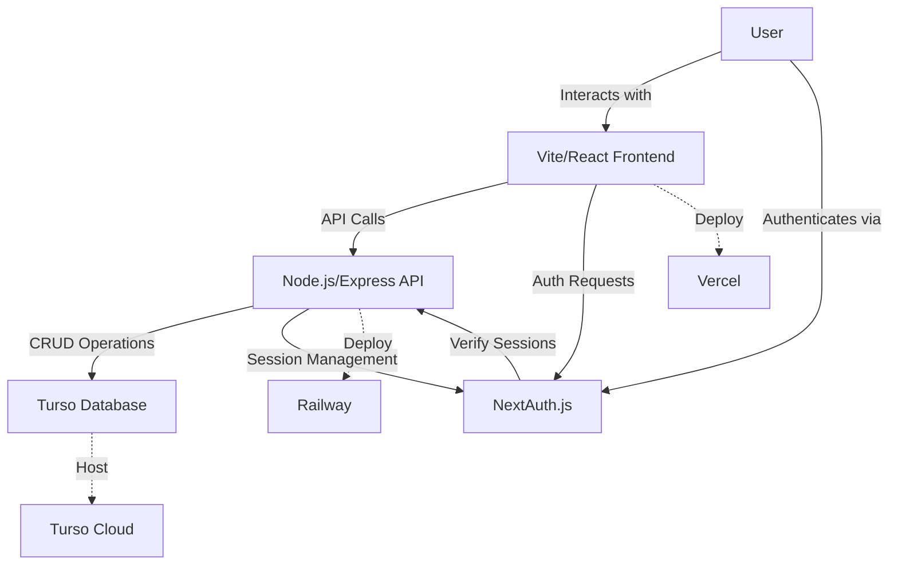

# Skill Launchpad MVP - Technology Documentation

## Technology Stack
- **Frontend**: Vite + React (TypeScript)
- **UI Components**: shadcn/ui
- **Styling**: Tailwind CSS
- **Backend**: Node.js + Express
- **Database**: Turso (SQLite)
- **Authentication**: Session cookies with NextAuth.js (supports social logins)
- **Deployment**:
  - Frontend: Vercel
  - Backend: Railway
  - Database: Turso Cloud

## Architecture Overview


## Key Components
1. **Frontend Application**
   - Vite + React (TypeScript) setup
   - shadcn/ui component library
   - Tailwind CSS for styling
   - React Router for navigation
   - NextAuth.js client integration

2. **Backend API**
   - Node.js + Express server
   - RESTful endpoints for:
     - Content management
     - Forum/discussion
     - User management
   - Session cookie authentication
   - Turso database client

3. **Authentication**
   - NextAuth.js for session management
   - Support for:
     - Email/password
     - Social providers (Google, GitHub, etc.)
   - Cookie-based sessions

4. **Database**
   - Turso (SQLite) for data persistence
   - Tables for:
     - Users
     - Content posts
     - Forum topics/replies
     - Memberships

## Development Approach
1. **Initial Setup**
   - Create Vite/React project
   - Add shadcn/ui components
   - Set up Node.js/Express backend
   - Configure Turso connection

2. **Core Features**
   - Implement authentication flow
   - Build content posting system
   - Create discussion forum
   - Add membership gating

3. **Polish & Deployment**
   - Styling with Tailwind CSS
   - Testing
   - Deploy backend to Railway
   - Deploy frontend to Vercel
   - Configure production database

## Deployment Strategy
- **Frontend**: Vercel
  - Automatic deployments from Git
  - Environment variables for API URLs
- **Backend**: Railway
  - Node.js environment
  - Persistent storage for sessions
  - Connection to Turso Cloud
- **Database**: Turso Cloud
  - Production instance
  - Regular backups

## API Documentation

### Authentication Endpoints
- `POST /api/auth/signin` - Sign in with credentials
- `POST /api/auth/signout` - Sign out user
- `GET /api/auth/session` - Get current session

### Content Endpoints
- `GET /api/content` - List all content
- `GET /api/content/:id` - Get specific content
- `POST /api/content` - Create new content
- `PUT /api/content/:id` - Update content
- `DELETE /api/content/:id` - Delete content

### Forum Endpoints
- `GET /api/forum/topics` - List all topics
- `POST /api/forum/topics` - Create new topic
- `GET /api/forum/topics/:id/replies` - Get replies for topic
- `POST /api/forum/topics/:id/replies` - Add reply to topic

## Database Schema

### Users Table
```sql
CREATE TABLE users (
  id TEXT PRIMARY KEY,
  name TEXT,
  email TEXT UNIQUE,
  password_hash TEXT,
  created_at TIMESTAMP DEFAULT CURRENT_TIMESTAMP,
  updated_at TIMESTAMP DEFAULT CURRENT_TIMESTAMP
);
```

### Content Table
```sql
CREATE TABLE content (
  id TEXT PRIMARY KEY,
  title TEXT NOT NULL,
  body TEXT,
  user_id TEXT REFERENCES users(id),
  created_at TIMESTAMP DEFAULT CURRENT_TIMESTAMP,
  updated_at TIMESTAMP DEFAULT CURRENT_TIMESTAMP
);
```

### Forum Topics Table
```sql
CREATE TABLE forum_topics (
  id TEXT PRIMARY KEY,
  title TEXT NOT NULL,
  body TEXT,
  user_id TEXT REFERENCES users(id),
  created_at TIMESTAMP DEFAULT CURRENT_TIMESTAMP,
  updated_at TIMESTAMP DEFAULT CURRENT_TIMESTAMP
);
```

### Forum Replies Table
```sql
CREATE TABLE forum_replies (
  id TEXT PRIMARY KEY,
  body TEXT NOT NULL,
  topic_id TEXT REFERENCES forum_topics(id),
  user_id TEXT REFERENCES users(id),
  created_at TIMESTAMP DEFAULT CURRENT_TIMESTAMP
);
```

## Environment Setup

### Required Environment Variables
```
# Frontend (.env)
VITE_API_URL=http://localhost:3000
VITE_AUTH_URL=http://localhost:3000/api/auth

# Backend (.env)
PORT=3000
DATABASE_URL=libsql://...
JWT_SECRET=your-secret-here
NEXTAUTH_SECRET=your-nextauth-secret
NEXTAUTH_URL=http://localhost:3000
GOOGLE_CLIENT_ID=your-google-client-id
GOOGLE_CLIENT_SECRET=your-google-client-secret